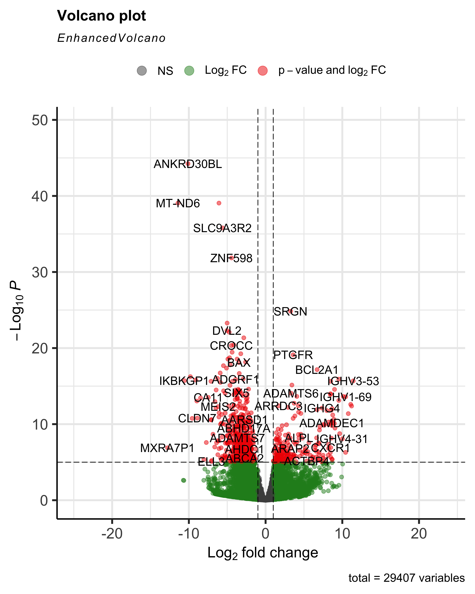
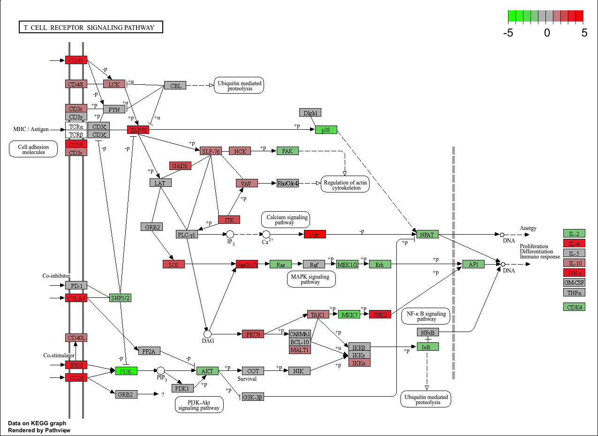

# TranscriptonomicsLBT2AMilo

# Immuunactivatie en signaalverstoring bij reuma zichtbaar in genexpressie en pathway-analyse

## Inleiding

Reumatoïde Artritis (RA) is een chronische auto-immuunziekte die leidt tot ontsteking van het gewrichtsslijmvlies en daardoor tot pijn, zwelling en gewrichtsschade (Smolen et al., 2016). De exacte oorzaak van RA is nog onduidelijk, maar het is bekend dat genetische aanleg en omgevingsfactoren een rol spelen in het ontstaan en de progressie van de ziekte (Firestein, 2003). Het immuunsysteem functioneert hierbij ontregeld, wat leidt tot chronische ontstekingen. Transcriptomics, waarbij expressie van alle genen in cellen wordt onderzocht kan helpen bij het identificeren van genen en metabole routes die betrokken zijn bij RA (Ding et al., 2024). In onderzoek van Black et al. (2023) wordt gesuggereert dat er in 2050 wereldwijd ongeveer 31,7 miljoen mensen last zullen hebben van RA. Inzicht in moleculaire processen kan bijdragen aan een beter begrip van ziekteverloop en het ontwikkelen van gerichte behandelingen. Dit onderzoek richt zich op het bepalen welke genen hoger of lager tot expressie komen en welke metabole routes hierdoor anders functioneren bij personen met RA. Zo is voor dit onderzoek de volgende hoofdvraag opgesteld: Hoe verschillen de genexpressieprofielen en metabole routes bij personen met reumatoïde artritis ten opzichte van gezonde personen?

### Deelvragen
- Welke specifieke genen tonen een verhoogde of verlaagde expressie bij RA-patiënten?

- Welke metabole routes worden beïnvloed door de veranderde genexpressie bij RA-patiënten?

## Methoden

In dit onderzoek zijn biopten van het synovium (het slijmvlies van gewrichten) gebruikt van acht personen: vier met RA en vier zonder RA (controle groep). De mensen met RA hadden langer dan twaalf maanden de diagnose en testten positief op ACPA. De controlegroep, mensen zonder RA, testten negatief op ACPA. In *tabel 1* is de leeftijd, het geslacht en de diagnose van de onderzochte mensen te zien.

**Tabel 1:** Overzicht van de onderzochte monsters, met leeftijd, geslacht en diagnose.

| Sample ID   | Leeftijd | Geslacht | Diagnose                        |
|-------------|-----|--------|----------------------------------|
| SRR4785819  | 31  | female | Normal ✅                       |
| SRR4785820  | 15  | female | Normal ✅                       |
| SRR4785828  | 31  | female | Normal ✅                       |
| SRR4785831  | 42  | female | Normal ✅                       |
| SRR4785979  | 54  | female | Rheumatoid arthritis ❌ |
| SRR4785980  | 66  | female | Rheumatoid arthritis ❌ |
| SRR4785986  | 60  | female | Rheumatoid arthritis ❌ |
| SRR4785988  | 59  | female | Rheumatoid arthritis ❌ |

Met behulp van de align-functie in de `Rsubread-package (versie 2.16.0)` zijn de ruwe sequencingdata uitgelijnd op het humane referentiegenoom (GRCh38). Na het sorteren en indexeren van de BAM-bestanden met `Rsamtools (versie 2.20.0)`, zijn de reads geteld met de functie featureCounts. De differentiële genexpressieanalyse werd uitgevoerd met `DESeq2 (versie 1.42.0)`. Om te kijken welke biologische processen betrokken zijn bij de veranderde genen is een GO-analyse gedaan met behulp van `goseq (versie 1.54.0)`. Deze analyse laat zien welke processen vaker voorkomen bij genen met veranderde expressie. Vervolgens is er een KEGG-pathwayanalyse gedaan met `pathview (versie 1.42.0)`.

## Resultaten

### Volcanoplot: verschillen in genexpressie wijzen op immuunactivatie 

De resultaten van de differentiële genexpressieanalyse tussen RA-patiënten en controles zijn weergegeven in _figuur 1_. In dit figuur wirden de genen gevisualiseerd op basis van hun log2-fold change (x-as) en de negatieve log10-transformatie van de p-waarde (y-as). Elk punt vertegenwoordigt één gen (n = 29.407 genen in totaal).

  
   
  <em>Figuur 1: Volcano plot van differentieel tot expressie gebrachte genen. De X-as toont de log₂-fold change, en de Y-as de –log₁₀(p-waarde). Rode punten vertegenwoordigen genen die zowel significant zijn in p-waarde als in expressieniveau (log₂ FC), groene punten zijn alleen significant in expressie, en grijze punten zijn niet significant. In totaal zijn 29.407 genen geanalyseerd.</em>

Uit de analyse blijkt dat een aantal genen sterk gedifferentieerd tot expressie komen. Genen zoals **SRGN, IGHV1-69 en BCL2A1** laten een verhoogde expressie zien. Deze resultaten geven een indruk van welke genen een rol kunnen spelen bij RA.

### GO-analyse verhoogde activieit van immuunrespons bij RA

De GO-analyse in _figuur 2_ laat zien dat de genen die differentieel tot expressie werden gebracht vooral betrokken zijn bij immuunprocessen zoals lymfocytenactivatie, leukocytenactivatie en immuunrespons. Deze termen geven een verhoogde activatie en regulatie van immuuncellen, zoals T-cellen aan. Dit laat zien dat het immuunsysteem actiever is bij RA, het kan zinvol zijn om te kijken naar belangrijke signaalroutes zoals die van de T-celreceptor (hsa04660).

  
  
  <em>Figuur 2: Gene Ontology (GO)-analyse van differentieel tot expressie gebrachte genen toont  processen gerelateerd aan het immuunsysteem, waaronder "positive regulation of immune system process", "lymphocyte activation" en "adaptive immune response". De kleurintensiteit geeft het percentage gen-hits binnen elk proces weer.</em>

### KEGG-pathway: verstoorde T-cel signalering als mogelijke kern van RA

De KEGG-analyse van de T-cell receptor signalling pathway (has04660) laat zien dat meerdere genen, zoals CD3E, CD28 en ZAP70, verhoogd tot expressie komen bij RA. Deze verstoorde signaalroute kan duiden op veranderingen in hoe genen aan- of uitgezet worden en hoe afweercellen reageren. Dit ondersteunt het idee dat het immuunsysteem bij mensen met RA anders werkt dat bij gezonde mensen, net als de bijbehorende metabole routes.

  
  
  <em>Figuur 3: Visualisatie van de T cel receptor (TCR) signaaltransductieroute met differentieel tot expressie gebrachte genen geprojecteerd op het KEGG-pathway hsa04660.</em>

## Conclusie 

Uit dit onderzoek blijkt dat de genexpressie van mensen met RA duidelijk verschilt van mensen zonder RA. In de volcanoplot kwamen meerdere genen naar voren die meer of minder werden gereguleerd. De GO-analyse bevestigde dit beeld: veel processen die met lymfocytactivatie te maken hebben veranderen. Dit wijst erop dat het afweersysteem bij mensen met RA ontregeld is. De KEGG-analyse liet zien dat in de T cell receptor signaling pathway zowel activerende genen _(zoals CD28 en ZAP70)_ als regulerende genen _(zoals NFAT en AP1)_ afwijkende expressie lieten zien. Dit kan betekenen dat signaaloverdracht bij T-cellen bij RA verstoord is.
Toekomstig onderzoek zou kunnen kijken naar specifieke schakels in deze pathways om te bepalen welke het meest geschikt zijn voor mogelijk therapie. Het kan ook interessant zijn om te kijken of er deze genexpressieveranderingen ook te vinden zijn in andere auto-immuunziekten.
